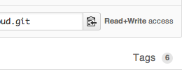

# Getting Started with the Rackspace Cloud SDK for PHP

The Rackspace Cloud SDK for PHP is a Software Development Kit
intended to help PHP developers more easily build applications
that access OpenStack and Rackspace clouds (both public and private
cloud offerings).

This SDK includes the following components:

1. The php-opencloud language bindings (under the `lib/` directory)
2. Documentation (under the `docs/` directory)
3. Sample code (under the `samples/` directory)

## How to install the SDK

The SDK is available from the Rackspace GitHub repository. You can
reach it at http://github.com/rackspace/php-opencloud.

To get the most reach release (stable) version of the code:

1. Click on the Tags link
2. Choose the most recent version, then click on either the `zip`
   or the `.tar.gz` button beneath it.
3. Find the downloaded file and uncompress it into the location
   of your choice. Make a note of the directory path; you will need
   it later.

## Building some cloud servers

In this example, you will write code that will create two 1GB
Cloud Servers running Ubuntu 13.04. You will need a text editor
to enter and edit this code. Here is the complete program:

    <?php
    require('/path/to/lib/php-opencloud.php');

    define('IMAGE_UBUNTU', '9922a7c7-5a42-4a56-bc6a-93f857ae2346');
    define('FLAVOR_1GB', '3');

    // establish our credentials
    $connection = new \OpenCloud\Rackspace(
        RACKSPACE_US,
        array( 'username' => 'USERNAME',
    	       'password' => 'PASSWORD'));

    // now, connect to the compute service
    $compute = $connection->Compute('cloudServersOpenStack', 'ORD');

    // first, find the image
    $image = $compute->Image(IMAGE_UBUNTU);

    // get a flavor object
    $flavor = $compute->Flavor(FLAVOR_1GB);

    // create the server
    for ($i=0; $i<2; $i++) {
		$server = $compute->Server();		// get a blank server
		$resp = $server->Create(array(
			'name' => sprintf('server-%d', $i),
			'image' => $image,
			'flavor' => $flavor));
		// check for errors
		if ($resp->HttpStatus() > 204)
			die("Error building server. Response is ".$resp->HttpBody());
		// display the root password
		printf("Server [%s] is building. Root password is [%s]\n",
			$server->Name(), $server->adminPass);
    }

## Understanding the program

    <?php
    require('/path/to/lib/php-opencloud.php');

The `<?php` is required for any PHP program (since PHP is usually embedded
within HTML).
The `require()` statement includes the **php-opencloud** library. You will
need to edit this so that the path is the actual directory path to the
`php-opencloud.php` file (which is under the `lib/` directory you just
downloaded).

    define('IMAGE_UBUNTU', '9922a7c7-5a42-4a56-bc6a-93f857ae2346');
    define('FLAVOR_1GB', '3');

These two constants define the image ID of the Ubuntu 13.04 image and
the 1GB flavor. To use a different flavor or image, look up the
available values through the Rackspace Control Panel or using the
`novaclient` CLI.

    // establish our credentials
    $connection = new \OpenCloud\Rackspace(
        RACKSPACE_US,
        array( 'username' => 'USERNAME',
    	       'password' => 'PASSWORD'));

This creates a `$connection` object using the `\OpenCloud\Rackspace`
connector. This object takes two parameters:

1. The URL of the authentication endpoint (`RACKSPACE_US` is a
   helpful constant provided by **php-opencloud**).
2. An array containing your username and password. Edit the `'USERNAME'`
   and `'PASSWORD'` values to reflect your own username and password.

    // now, connect to the compute service
    $compute = $connection->Compute('cloudServersOpenStack', 'ORD');

This creates a `Compute` object, which is a connection to a specific
instance of a service (in this case, the service is named
`cloudServersOpenStack`) in a region (in this case, the `ORD` region).
The `Compute()` method on the connection is a *factory method* that
returns a new connection to a service with each invocation.

    // first, find the image
    $image = $compute->Image(IMAGE_UBUNTU);
    // get a flavor object
    $flavor = $compute->Flavor(FLAVOR_1GB);

These are two more factory methods that return an `Image` object and
a `Flavor` object, respectively.

    // create the server
    for ($i=0; $i<2; $i++) {
		$server = $compute->Server();		// get a blank server
		$resp = $server->Create(array(
			'name' => sprintf('server-%d', $i),
			'image' => $image,
			'flavor' => $flavor));
		// check for errors
		if ($resp->HttpStatus() > 204)
			die("Error building server. Response is ".$resp->HttpBody());
		// display the root password
		printf("Server [%s] is building. Root password is [%s]\n",
			$server->Name(), $server->adminPass);
    }

This actually creates the servers. It starts by creating a new,
empty server object from the `$compute` service by using the
`Server()` method.
Finally, it calls the `Create()` method on the `Server` object.
This takes an parameter that is an array of properties. `name`,
`image`, and `flavor` are the required properties for creating
a new server.

